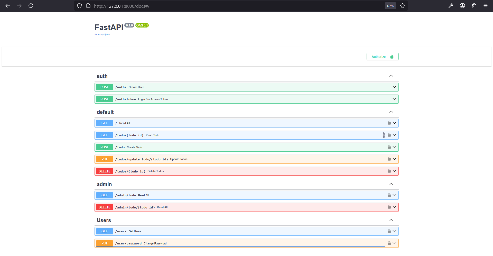

# FastAPI Todo App with JWT Authentication & Role-Based Access

A full-stack backend project built using **FastAPI**, **SQLAlchemy**, and **JWT authentication**, with support for user registration, login, secure password hashing, and CRUD operations on todo items. Admins can access and manage all todos.

---

## Features

- 🔐 JWT-based Authentication (Login & Token)
- 👤 Role-Based Access (`admin` and `user`)
- 🔄 Full CRUD for Todo items
- 🔐 Secure Password Hashing with `bcrypt`
- 🧑 User registration and password update functionality
- 🧠 Clean modular code structure with routers
- 🗃️ SQLite for local development

---

##  Tech Stack

| Tool | Purpose |
|------|---------|
| [FastAPI](https://fastapi.tiangolo.com) | Web framework |
| [SQLAlchemy](https://www.sqlalchemy.org/) | ORM for database |
| [PassLib](https://passlib.readthedocs.io/en/stable/) | Password hashing |
| [python-jose](https://python-jose.readthedocs.io/en/latest/) | JWT token handling |
| [Uvicorn](https://www.uvicorn.org/) | ASGI server |
| [SQLite](https://www.sqlite.org/docs.html) | Local database |

---

##  Project Structure

```fastapi-todo-auth/
├── main.py # Entry point of the app
├── database.py # DB setup and session creation
├── models.py # SQLAlchemy models
├── Screenshots/ # Screen Captures of project
├── routers/ # API route definitions
│ ├── auth.py # Auth (register, login, token)
│ ├── todos.py # CRUD for todos (user scope)
│ ├── users.py # Get profile, change password
│ └── admin.py # Admin-only operations
├── requirements.txt # Python dependencies
├── .gitignore # Files to ignore
└── README.md # Project documentation
```

---

## Setup Instructions

### Prerequisites

- Python 3.10+
- `pip` installed
- [Git](https://git-scm.com/) (for cloning)

---

### Clone the Repository

```bash
git clone https://github.com/YOUR_USERNAME/fastapi-todo-auth.git
cd fastapi-todo-auth
```

### Create Virtual Environment

```bash
python -m venv fastapienv
fastapienv\Scripts\activate 
```

### Install Dependencies

```bash
pip install -r requirements.txt
```

### Run the App

```bash
uvicorn main:app --reload
```
Visit: http://127.0.0.1:8000/docs for Swagger API UI

---

## Authentication Flow

- Register a user at `POST /auth/`
- Login with `POST /auth/token` to get a JWT token
- Use `Bearer <token>` in the **Authorize** button in Swagger 

## API Endpoints

### Auth (`/auth`)
- `POST /auth/` – Register new user
- `POST /auth/token` – Login and get JWT token

### User (`/user`)
- `GET /user/` – Get current user's profile
- `PUT /user/password` – Change password

### Todos (`/`)
- `GET /` – Get all todos of the current user
- `POST /todo` – Create a new todo
- `GET /todo/{id}` – Get a specific todo
- `PUT /todos/update_todo/{id}` – Update a todo
- `DELETE /todos/{id}` – Delete a todo

### Admin (`/admin`)
- `GET /admin/todo` – Get all todos (admin only)
- `DELETE /admin/todo/{id}` – Delete any todo (admin only)

> Note: Admin-only routes require `role: admin` in the JWT token.

## Sample User Roles

When creating a user via `POST /auth/`, use the following format:

```json
{
  "email": "admin@example.com",
  "user": "adminuser",
  "first_name": "Admin",
  "last_name": "User",
  "password": "adminpass",
  "role": "admin"
}
```
For a regular user, set "role": "user".

## Security Notes

- Passwords are hashed using `bcrypt`.

- JWT token expires after 20 minutes.

- Only users with the `admin` role can access `/admin` routes.

## Swagger UI
FastAPI provides a built-in interactive API documentation at: [http://127.0.0.1:8000/docs](http://127.0.0.1:8000/docs)


You can use this interface to:

- Register new users
- Login and get JWT tokens
- Authorize requests using the "Authorize" button
- Test all endpoints including user and admin routes

### Screenshot



This interface makes testing and development much faster and more convenient.
